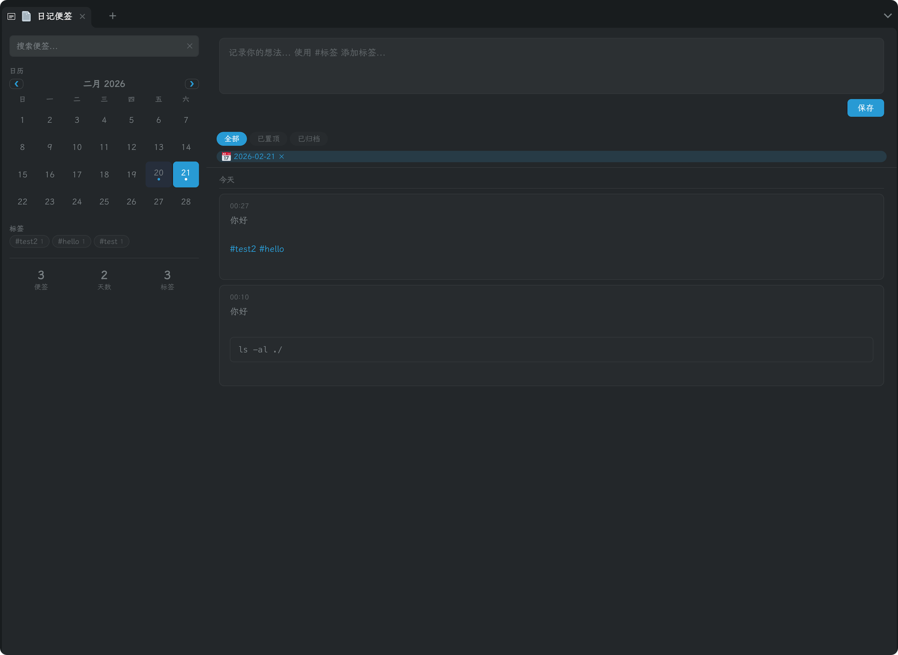

# DayMemo - Memos-like Plugin for SiYuan

A lightweight, [Memos](https://github.com/usememos/memos)-inspired quick note-taking plugin for [SiYuan](https://b3log.org/siyuan). Capture thoughts, tag them, search and filter — all within SiYuan's main content area.

 

## Features

- **Main Tab View** — Opens as a full tab in SiYuan's main content area, with a two-column Memos-style layout
- **Sidebar Dock Panel** — Also available as a dock panel in SiYuan's sidebar (left/right/bottom); compact single-column layout for quick capture without leaving your current tab
- **Markdown Support** — Bold, italic, code, links, images, and more — rendered inline
- **Interactive Checklist** — Use `- [ ]` and `- [x]` syntax for task lists; checkboxes are clickable and toggle state is saved automatically
- **Mermaid Diagrams** — Fenced code blocks with ` ```mermaid ` are rendered as diagrams (flowcharts, sequence diagrams, etc.) using SiYuan's built-in Mermaid — zero extra dependencies
- **Image & Attachment Upload** — Upload images (button, paste, drag-drop) and arbitrary file attachments (zip, pdf, etc.) directly into memos; stored in SiYuan's `data/assets/` and synced automatically
- **Multi-Level Tag System** — Use `#tag` or `#parent/child/grandchild` syntax (Flomo-style) to organize memos; tags are displayed as a collapsible tree in the sidebar with expand/collapse toggles; clicking a parent tag filters all its child tags too
- **Calendar View** — Real month calendar with `‹` `›` navigation, "Today" button to jump back, heatmap coloring by memo density, and click-to-filter by date
- **Timeline View** — Memos grouped by date, newest first
- **Search** — Full-text search across all memos in the sidebar
- **Filter Tabs** — Switch between All / Pinned / Archived views
- **Add to Daily Note** — One-click to append any memo into SiYuan's Daily Note for the memo's creation date, with source attribution; supports custom path templates with rich date variables (see Settings below)
- **Regex Replacement Rules** — Define custom regex find-and-replace rules (in Settings) that are automatically applied to memo content before it's added to Daily Note — e.g., convert `#task ` lines into `- [ ] ` checklist items
- **Right-Click Context Menu** — Right-click any memo for quick actions: edit, pin, archive, add to daily note, set reminder, copy content, delete
- **Reminders** — Set a reminder on any memo via the right-click menu; a datetime picker dialog defaults to 10 minutes from now; when the time arrives, you get both a SiYuan in-app notification and a browser system notification
- **Annotations** — Annotate any memo to create a linked note (similar to Flomo's annotation feature); the annotation and source memo are connected with bidirectional links for easy navigation; annotation previews are displayed inline below the source memo; deleting a memo automatically cleans up all bidirectional annotation links to keep data consistent
- **Random Review** — One-click "Random Review" button in the sidebar to revisit random memos in a card-style dialog; browse through a batch of 5, navigate back and forth, or shuffle for a fresh set; edit memos directly in the review dialog (`Ctrl+Enter` to save, `Escape` to cancel) — inspired by Flomo's daily review
- **Pin & Archive** — Pin important memos to top, archive old ones to reduce clutter
- **Cloud Sync Safe** — Timestamp-based merge logic with soft-delete tombstones for multi-device sync via SiYuan Cloud
- **Dark Mode** — Follows SiYuan's theme automatically
- **i18n** — English and Chinese supported

## Preview



## Usage

1. Click the **DayMemo** icon in the top toolbar to open the full tab view, or find **DayMemo** in the sidebar dock for a compact panel
2. Type your memo in the editor area, use `#tag` or `#parent/child` for multi-level tags
3. Attach images (click 🖼, paste from clipboard, or drag-drop) and files (click 📎) — they upload to SiYuan's `assets/` folder
4. Use `- [ ]` for checklists (clickable after saving) and ` ```mermaid ` blocks for diagrams
5. Press `Ctrl+Enter` or click Save
6. Use the filter tabs (All / Pinned / Archived) to switch views
7. Click a date on the calendar to filter memos for that day; use **Today** button to jump back to the current month
8. Click tags in the sidebar to filter by tag
9. Hover over a memo to see edit / pin / archive / annotate / 📅 add to daily note / delete actions, or **right-click** for a context menu with all actions plus **Set Reminder** and **Annotate**
10. Click the annotate button on any memo to create an annotation — a new linked memo; annotations appear below the source memo with a preview, and clicking navigates between them
11. Double-click a memo's content to quickly enter edit mode
12. Select and copy text directly from memo content, or use the right-click menu to copy the full memo content

## Settings

Open plugin settings (click the gear icon on the DayMemo plugin card in SiYuan's Marketplace → Installed) to configure:

- **Daily Note Path Template** — Custom path template for the "Add to Daily Note" feature. Leave empty to use your notebook's default `dailyNoteSavePath`. Example:

  ```
  /Daily Note/{{now | date "2006/01"}}/第{{now | ISOWeek}}周/{{now | date "2006-01-02"}}-周{{now | WeekdayCN}}
  ```

  Supported template variables:

  | Template | Description | Example Output |
  |----------|-------------|----------------|
  | `{{now \| date "2006-01-02"}}` | Go-style date format | `2026-04-07` |
  | `{{now \| date "15:04:05"}}` | Go-style time format | `14:30:00` |
  | `{{now \| ISOWeek}}` | ISO week number | `15` |
  | `{{now \| ISOYear}}` | ISO week-numbering year | `2026` |
  | `{{now \| Weekday}}` | Day of week (0=Sunday) | `2` |
  | `{{now \| WeekdayCN}}` | Day of week in Chinese | `二` |
  | `{{now \| WeekdayCN2}}` | Day of week in Chinese with prefix | `周二` |

  Go date format tokens: `2006` (year), `01` (month), `02` (day), `15` (hour-24h), `03` (hour-12h), `04` (minute), `05` (second), `PM`/`pm`, `Monday`/`Mon`, `January`/`Jan`.

- **Use Current Date for Daily Note** — When enabled, uses the current system date when adding a memo to Daily Note; when disabled (default), uses the memo's creation date.

- **Enable Regex Replacement** — Toggle switch to enable/disable regex replacement rules when adding memos to Daily Note.

- **Replacement Rules** — A list of regex find-and-replace pairs applied (in order) to memo content before appending to Daily Note. Each rule has:
  - **Match pattern** — A JavaScript-compatible regex (applied with `gm` flags). Example: `^#task `
  - **Replacement text** — The replacement string. Example: `- [ ] `

  Use the `+` / `-` buttons to add or remove rules. Rules with an empty match pattern are ignored.

## Data Storage & Sync

- Memos: `data/storage/petal/siyuan-plugin-day-memo/memos-data`
- Settings: `data/storage/petal/siyuan-plugin-day-memo/settings`

Both are automatically included in SiYuan's cloud sync.

Uploaded images and attachments are stored in SiYuan's standard `data/assets/` directory, also included in cloud sync.

**Multi-device safety**: When loading data, the plugin performs a timestamp-based merge — for each memo, the version with the newer `updatedAt` wins. Deletes use soft-delete (tombstone) flags so they propagate correctly across devices.

## Development

```bash
# Install dependencies
pnpm i

# Development build (watch mode)
pnpm dev

# Production build (generates package.zip)
pnpm build
```

## Tech Stack

- **Language**: TypeScript (vanilla DOM, no framework)
- **Build**: Webpack + esbuild-loader + SCSS
- **Runtime**: SiYuan Plugin API (petal v1.1.7)
- **Min SiYuan Version**: 3.3.0

## License

MIT
